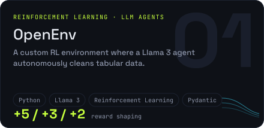
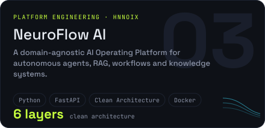
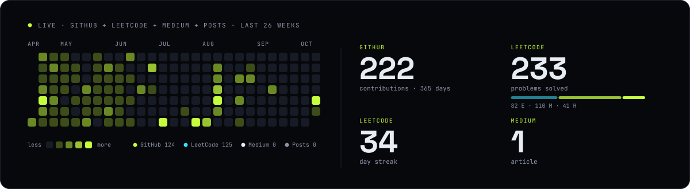
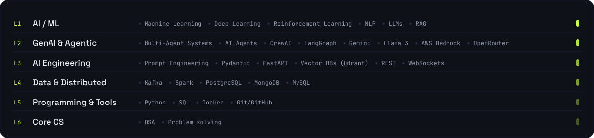

<picture>
  <source media="(prefers-color-scheme: dark)" srcset="assets/hero-dark.svg">
  <source media="(prefers-color-scheme: light)" srcset="assets/hero-light.svg">
  
</picture>

I engineer AI systems designed to run in production, not just perform well in a demo. At HNNOIX's NeuroFlow AI I built core platform infrastructure — a provider-agnostic LLM Gateway, RAG Runtime, AI Memory Layer and agent-execution runtimes — on Clean Architecture and SOLID. Before that I shipped two GenAI systems as a freelancer: multi-agent fact verification and knowledge-grounded QA. Final-year B.Tech CSE at PDEU, open to AI Engineer / ML Engineer / GenAI Engineer roles.

[Portfolio](https://chetangadhiya.vercel.app) · [Resume](https://chetangadhiya.vercel.app/resume) · [LinkedIn](https://www.linkedin.com/in/chetan-gadhiya-4923a6284) · [X](https://x.com/chetan_gadhiya7) · [Medium](https://medium.com/@ChetanGadhiy017) · [LeetCode](https://leetcode.com/u/chetangadhiya4939/) · [Email](mailto:chetan.certi.001@gmail.com)

## Hidden layers

<picture>
  <source media="(prefers-color-scheme: dark)" srcset="assets/experience-dark.svg">
  <source media="(prefers-color-scheme: light)" srcset="assets/experience-light.svg">
  
</picture>

## Attention

<table>
<tr><td width="50%" valign="top" align="center"><a href="https://github.com/chetangadhiya5062/open-env-nuclei"><picture>
  <source media="(prefers-color-scheme: dark)" srcset="assets/projects/openenv-dark.svg">
  <source media="(prefers-color-scheme: light)" srcset="assets/projects/openenv-light.svg">
  
</picture></a></td><td width="50%" valign="top" align="center"><a href="https://github.com/chetangadhiya5062/autonomous_mail"><picture>
  <source media="(prefers-color-scheme: dark)" srcset="assets/projects/aethermail-dark.svg">
  <source media="(prefers-color-scheme: light)" srcset="assets/projects/aethermail-light.svg">
  
</picture></a></td></tr>
<tr><td width="50%" valign="top" align="center"><a href="https://github.com/chetangadhiya5062/NeuroFlow-AI"><picture>
  <source media="(prefers-color-scheme: dark)" srcset="assets/projects/neuroflow-ai-dark.svg">
  <source media="(prefers-color-scheme: light)" srcset="assets/projects/neuroflow-ai-light.svg">
  
</picture></a></td><td width="50%" valign="top" align="center"><a href="https://github.com/chetangadhiya5062/misinformation_ai"><picture>
  <source media="(prefers-color-scheme: dark)" srcset="assets/projects/truth-ai-dark.svg">
  <source media="(prefers-color-scheme: light)" srcset="assets/projects/truth-ai-light.svg">
  
</picture></a></td></tr>
</table>

AetherMail and Truth AI were built with teammates; see each repository's contributors. Case studies: [chetangadhiya.vercel.app](https://chetangadhiya.vercel.app/#projects).

## Training loop

<picture>
  <source media="(prefers-color-scheme: dark)" srcset="assets/stats-dark.svg">
  <source media="(prefers-color-scheme: light)" srcset="assets/stats-light.svg">
  
</picture>

## Output logits

<!-- FEED:START -->
- `github` · 2026-10-10 · [open-env-nuclei: Merge pull request #9 from chetangadhiya5062/v3](https://github.com/chetangadhiya5062/open-env-nuclei/commit/18874dadf580278afd132c09aa83eb1cbceba878)
- `github` · 2026-10-10 · [open-env-nuclei: docs: refresh README benchmark table, learning curve, and phase notes…](https://github.com/chetangadhiya5062/open-env-nuclei/commit/bb1bf7a6f4d68bb80c6440a0bd81f35ef23481dc)
- `medium` · 2025-04-22 · [When Tech Meets Laziness: Are We Losing the Drive to Do Things Ourselves?](https://medium.com/@ChetanGadhiy017/when-tech-meets-laziness-are-we-losing-the-drive-to-do-things-ourselves-e019bfca4783)
<!-- FEED:END -->

## Parameters

<picture>
  <source media="(prefers-color-scheme: dark)" srcset="assets/skills-dark.svg">
  <source media="(prefers-color-scheme: light)" srcset="assets/skills-light.svg">
  
</picture>

---

built as a forward pass · auto-updated 2026-10-10 · source → [chetangadhiya.vercel.app](https://chetangadhiya.vercel.app)
